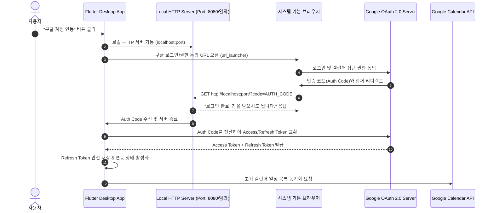

# 📅 구글 캘린더 연동 상세 설계 및 구현 계획서 (Google Calendar Integration Plan)

본 문서는 현재 로컬 기반으로 동작하는 스케줄 캘린더 앱에 **Google Calendar API를 연동하여 클라우드-로컬 간 양방향 실시간 동기화(Two-way Sync)**를 구현하기 위한 아키텍처 및 상세 실행 계획서입니다.

---

## 1. 연동 목표 및 핵심 원칙

1. **오프라인 우선 (Offline-First) 구조 유지**:
   - 네트워크 연결이 끊기더라도 로컬 저장소(`SharedPreferences` / 로컬 DB)를 통해 앱을 즉시 사용할 수 있어야 하며, 온라인 전환 시 변경 사항이 자동 동기화됩니다.
2. **양방향 동기화 (Two-Way Sync)**:
   - **App ➡️ Google Calendar**: 앱에서 생성/수정/삭제한 일정이 사용자의 구글 캘린더에 즉시 반영됩니다.
   - **Google Calendar ➡️ App**: 스마트폰, 웹 브라우저 등 외부에서 구글 캘린더에 등록/수정/삭제된 일정이 데스크톱 앱으로 자동 동기화됩니다.
3. **데스크톱 친화적 인증 (OAuth 2.0 Loopback)**:
   - Windows/macOS 데스크톱 환경에 최적화된 로컬 루프백 웹서버 기반의 구글 로그인 프로세스를 구현합니다.

---

## 2. 인증 아키텍처 (OAuth 2.0 Loopback Flow)

Flutter 데스크톱(Windows) 환경에서는 웹뷰가 아닌 기본 브라우저를 통한 **Loopback IP Flow (RFC 8252)**를 사용하는 것이 표준 권장 방식입니다.



---

## 3. 데이터 모델 확장 (Model Extension)

기존 [schedule_event.dart](file:///c:/Users/3031232/StudioProjects/untitled/lib/models/schedule_event.dart) 모델에 구글 캘린더 연동 필드를 추가합니다.

### 3.1 추가 필드 명세

```dart
class ScheduleEvent {
  // --- 기존 필드 ---
  final String id;              // 앱 로컬 UUID
  String title;
  String description;
  DateTime date;
  bool hasTime;
  int hour;
  int minute;
  int colorValue;
  bool isCompleted;
  bool enableNotification;
  int notificationOffsetMinutes;
  bool isNotified;
  final DateTime createdAt;
  DateTime updatedAt;

  // --- 🆕 구글 캘린더 연동 필드 ---
  String? googleEventId;        // 구글 캘린더 이벤트 고유 ID (null이면 로컬 전용 일정)
  String? googleCalendarId;     // 연동된 캘린더 ID ('primary' 등)
  String? etag;                 // 구글 캘린더 ETag (동시 수정 충돌 감지용)
  SyncStatus syncStatus;        // synced, pending_upload, pending_update, pending_delete, local_only
  DateTime? lastSyncedAt;       // 마지막 동기화 시각
  bool isDeletedLocally;        // 오프라인 삭제 시 서버 삭제 대기를 위한 툼스톤(Tombstone) 플래그
}

enum SyncStatus {
  synced,          // 동기화 완료
  pendingUpload,   // 구글 캘린더에 업로드 필요 (신규 생성)
  pendingUpdate,   // 구글 캘린더 수정 필요
  pendingDelete,   // 구글 캘린더 삭제 필요
  localOnly,       // 동기화 제외 로컬 전용
}
```

### 3.2 데이터 매핑 테이블 (Mapping Table)

| 앱 모델 (`ScheduleEvent`) | Google Calendar Event API | 비고 |
| :--- | :--- | :--- |
| `title` | `summary` | 일정 제목 |
| `description` | `description` | 일정 상세 설명 / 메모 |
| `date`, `hour`, `minute`, `hasTime` | `start.dateTime` / `start.date`<br/>`end.dateTime` / `end.date` | 종일 일정(`date`) 또는 시간 지정 일정(`dateTime`)으로 매핑 |
| `colorValue` (ARGB) | `colorId` (1~11) | 구글 캘린더 팔레트 ID와 앱 ARGB 색상 상호 변환 매핑 |
| `enableNotification`, `notificationOffsetMinutes` | `reminders.overrides` | 팝업 알림 분(minutes) 설정 매핑 |
| `googleEventId` | `id` | 구글 캘린더 리소스 ID |
| `etag` | `etag` | 충돌 감지용 버전 태그 |

---

## 4. 동기화 및 충돌 해결 알고리즘 (Sync Strategy)

### 4.1 증분 동기화 (Incremental Sync with Sync Tokens)
* 구글 캘린더의 `events.list(calendarId: 'primary', syncToken: previousSyncToken)` API를 사용하여 **마지막 동기화 이후 변경되거나 삭제된 항목만 효율적으로 수신**.
* 전체 일정을 매번 다운로드하지 않으므로 트래픽 및 API 쿼터 절약.

### 4.2 오프라인 삭제 툼스톤(Tombstone) 처리
* 오프라인 상태에서 사용자가 일정을 삭제한 경우:
  1. `googleEventId`가 있는 일정은 즉시 DB에서 완전히 지우지 않고 `isDeletedLocally = true`, `syncStatus = SyncStatus.pendingDelete`로 마킹.
  2. 네트워크 복구 후 구글 서버에 `events.delete(id: googleEventId)` 호출 성공 시 로컬 DB에서 완전 제거.

### 4.3 동시 수정 충돌 해결 (Conflict Resolution)
* 로컬과 구글 서버 양쪽에서 동일한 일정이 동시에 수정된 경우:
  * **기본 전략**: **최신 수정 우선 (Last-Write-Wins)** (`updatedAt` 비교).
  * **확장 옵션**: 충돌 감지 시 사용자에게 팝업 다이얼로그로 선택권 제공 ("로컬 내용 유지" vs "구글 내용 덮어쓰기").

---

## 5. 필요 패키지 의존성 ([pubspec.yaml](file:///c:/Users/3031232/StudioProjects/untitled/pubspec.yaml))

```yaml
dependencies:
  # ... 기존 의존성 ...
  
  # 구글 API 클라이언트 & 인증
  googleapis: ^13.2.0
  googleapis_auth: ^1.6.0
  http: ^1.2.2
  url_launcher: ^6.3.0
```

---

## 6. 신규 파일 및 컴포넌트 아키텍처

```
lib/
├── services/
│   ├── google_auth_service.dart       # 🆕 OAuth 2.0 Loopback 로그인/로그아웃/토큰 갱신
│   ├── google_calendar_service.dart   # 🆕 구글 캘린더 CRUD 호출 및 동기화 엔진
│   ├── notification_service.dart
│   ├── storage_service.dart           # 🔄 구글 연동 정보/동기화 토큰 저장 추가
│   └── tray_and_window_service.dart
├── models/
│   ├── schedule_event.dart            # 🔄 구글 이벤트 연동 필드 확장
│   └── sync_state.dart                # 🆕 동기화 상태 모델 (계정명, 마지막 동기화 시각 등)
└── widgets/
    ├── settings_dialog.dart           # 🔄 구글 계정 연동/동기화 설정 섹션 UI 추가
    └── sync_status_indicator.dart     # 🆕 메인 화면 상단 동기화 상태 및 수동 동기화 버튼
```

---

## 7. 단계별 구현 로드맵 (Step-by-Step Implementation Roadmap)

### 🔹 Phase 1: Google Cloud Console 설정 및 OAuth 인증 모듈 구현
1. Google Cloud Console 프로젝트 생성 및 **Google Calendar API** 활성화.
2. 데스크톱 앱용 OAuth 2.0 클라이언트 ID 및 Secret 발급.
3. `GoogleAuthService` 구현:
   - `http.Server`를 통한 로컬 루프백 리스너 구동.
   - `url_launcher`로 기본 브라우저 열기.
   - Auth Code 수신 후 Access Token / Refresh Token 교환 및 저장.
   - 자동 토큰 갱신(Token Refresh) 처리.

### 🔹 Phase 2: 데이터 모델 확장 및 저장소 고도화
1. `ScheduleEvent` 모델에 `googleEventId`, `etag`, `syncStatus`, `isDeletedLocally` 필드 추가.
2. `StorageService`에 구글 계정 정보, 동기화 토큰(`syncToken`), 삭제 툼스톤 필터링 로직 추가.

### 🔹 Phase 3: Google Calendar API 통신 & 동기화 서비스 개발
1. `GoogleCalendarService` 구현:
   - 구글 캘린더 일정 불러오기 (Fetch / Incremental Sync).
   - 앱 ➡️ 구글 캘린더 신규 등록 / 수정 / 삭제 Push 기능.
   - 색상 매핑 및 시간/종일 일정 변환 유틸리티 구현.

### 🔹 Phase 4: UI 및 환경설정 연동
1. **환경설정 다이얼로그 (`SettingsDialog`)**:
   - 구글 연동 상태 표시 (연동된 구글 계정 이메일, 프로필).
   - [구글 계정 로그인] / [연동 해제] 버튼.
   - [지금 즉시 동기화] 수동 실행 버튼.
2. **메인 캘린더 화면 (`CalendarScreen`)**:
   - 상단 앱바에 동기화 상태 인디케이터 (동기화 중 스피너, 완료 체크, 오류 아이콘).
   - 새로고침(동기화) 버튼 추가.
3. **일정 추가/수정 다이얼로그 (`EventDialog`)**:
   - "구글 캘린더와 동기화" 여부 토글 옵션 제공.

### 🔹 Phase 5: 예외 처리, 백그라운드 자동 동기화 및 검증
1. 앱 실행 시 자동 동기화 및 주기적 백그라운드 동기화 (5분~15분 타이머).
2. 네트워크 오류, 토큰 만료, 동기화 충돌 상황에 대한 방어 로직 및 사용자 안내 스낵바.
3. Windows 데스크톱 환경 전체 빌드 및 최종 검증.
