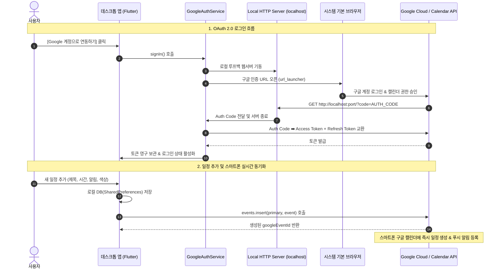

# 📘 Google 캘린더 연동 및 사용 매뉴얼 (Google Calendar Manual)

본 문서는 데스크톱 캘린더 앱과 **Google Calendar(스마트폰 및 웹) 간의 실시간 양방향 연동 기능**에 대한 API 설정, 아키텍처, 데이터 매핑 및 사용 가이드를 정리한 통합 매뉴얼입니다.

---

## 1. 개요 및 연동 효과

* **PC ➡️ 스마트폰 실시간 푸시**:
  * PC 앱에서 일정이나 할 일을 추가/수정/삭제하면 즉시 Google Calendar API(`primary` 캘린더)를 통해 클라우드에 반영되어 **스마트폰의 Google Calendar 앱에서 바로 확인**할 수 있습니다.
  * PC 앱에서 설정한 사전 알림(0분, 10분, 30분, 1시간, 1일 전)이 Google Calendar 알림으로 등록되어 **스마트폰에서도 동일하게 푸시 알림**이 울립니다.
* **스마트폰 ➡️ PC 양방향 동기화**:
  * 스마트폰이나 웹에서 추가/수정한 일정도 PC 앱을 켜거나 상단 [동기화] 버튼을 누르면 PC 로컬 캘린더로 자동 동기화됩니다.
* **오프라인 우선 (Offline-First)**:
  * 네트워크 연결이 없어도 로컬에서 자유롭게 일정을 관리할 수 있으며, 온라인 복구 시 변경 사항이 구글 서버에 자동 동기화됩니다.

---

## 2. Google Cloud Console API 설정 및 발급 정보

### 2.1 적용된 OAuth 2.0 클라이언트 정보
* **Client ID**: `432895220774-18ur...apps.googleusercontent.com`
* **Client Secret**: `GOCSPX-Wne...` (프로젝트 내부 설정 완료)
* **Redirect URI**: `http://localhost` (Loopback IP Flow)
* **API Scopes**:
  * `https://www.googleapis.com/auth/calendar` (Google Calendar API 전체 권한)
  * `https://www.googleapis.com/auth/calendar.events` (일정 읽기/쓰기)
  * `https://www.googleapis.com/auth/userinfo.email` (계정 이메일 조회)
  * `https://www.googleapis.com/auth/userinfo.profile` (계정 프로필 조회)

### 2.2 Google Cloud Console 설정 절차 요약
1. **Google Cloud Console 접속**: [https://console.cloud.google.com/](https://console.cloud.google.com/)
2. **프로젝트 생성**: `desktop-calendar-app`
3. **API 활성화**: **Google Calendar API** 검색 후 [사용] 클릭
4. **OAuth 동의 화면 설정**:
   * User Type: `외부(External)`
   * Scopes: `calendar`, `calendar.events` 추가
   * **테스트 사용자(Test Users)**: 연동할 본인의 구글 계정 이메일 추가 (중요 ⭐️)
5. **OAuth 2.0 클라이언트 ID 생성**:
   * 애플리케이션 유형: `데스크톱 앱 (Desktop App)`

---

## 3. 인증 및 동기화 아키텍처

---

## 4. 데이터 속성 매핑 (Data Mapping Table)

| 데스크톱 앱 모델 (`ScheduleEvent`) | Google Calendar Event API | 비고 |
| :--- | :--- | :--- |
| `title` | `summary` | 일정 제목 |
| `description` | `description` | 일정 상세 설명 / 메모 |
| `date`, `hour`, `minute`, `hasTime` | `start.dateTime` / `start.date` `end.dateTime` / `end.date` | 종일 일정(`date`) 또는 시간 지정 일정(`dateTime`, 기본 1시간) |
| `colorValue` (ARGB) | `colorId` (1~11) | Blue(9), Green(10), Red(11), Amber(6), Purple(3), Pink(4), Gray(8), Cyan(7) |
| `enableNotification`, `notificationOffsetMinutes` | `reminders.overrides` | `EventReminder(method: 'popup', minutes: offset)` 매핑 ➡️ **스마트폰 푸시 알림 발송** |
| `googleEventId` | `id` | Google Calendar 이벤트 고유 ID |
| `etag` | `etag` | 동시 수정 충돌 감지용 태그 |
| `isCompleted` | `extendedProperties.private.isCompleted` | 완료 체크박스 상태 확장 속성 저장 |
| `id` (로컬 UUID) | `extendedProperties.private.localId` | 로컬 ID와 원격 이벤트 1:1 매핑 |

---

## 5. 단계별 사용 및 테스트 가이드

### 📱 1. Google 계정 연동하기
1. 앱 우측 상단의 **[⚙️ 설정]** 아이콘을 클릭합니다.
2. `Google 캘린더 실시간 연동` 영역에서 **[Google 계정으로 연동하기]** 버튼을 클릭합니다.
3. 브라우저가 열리면 발급 시 **테스트 사용자로 등록한 구글 계정**으로 로그인하고 권한을 허용합니다.
4. 브라우저에 완료 메시지가 나타나고 앱으로 돌아오면 **연동된 이메일이 표시**되며 연동이 완료됩니다.

### 📝 2. PC ➡️ 스마트폰 실시간 반영 확인
1. PC 앱에서 **[+ 予定を追加(일정 추가)]** 버튼을 클릭합니다.
2. 제목(예: `스마트폰 연동 테스트`), 시작 시간, 사전 알림(예: `10분 전`), 색상을 지정하고 **[保存(저장)]**을 누릅니다.
3. 스마트폰의 **Google Calendar 앱**을 열어 새로 생성된 일정을 확인합니다.
4. 설정한 알림 시간에 스마트폰에서 구글 캘린더 푸시 알림이 정상적으로 울리는지 확인합니다.

### 🔄 3. 스마트폰 ➡️ PC 동기화 확인
1. 스마트폰 구글 캘린더 앱에서 새 일정을 등록하거나 기존 일정을 수정합니다.
2. PC 앱의 상단 AppBar에서 **[🔄 동기화]** 아이콘(또는 설정 창의 [지금 동기화])을 누릅니다.
3. 스마트폰에서 추가한 일정이 PC 캘린더 화면에 자동으로 추가되는 것을 확인합니다.
