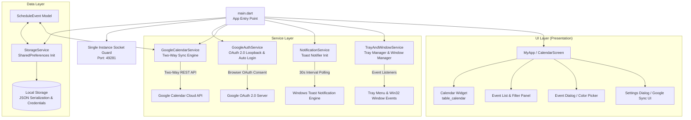

# 📌 프로젝트 개요 및 방향성 (Project Overview & Direction)

## 1. 프로젝트 정의 및 핵심 목표 (Project Definition & Vision)

본 프로젝트는 **Windows를 비롯한 데스크톱 환경에 최적화된 고성능, 네이티브 스타일의 일정 및 캘린더 관리 애플리케이션**입니다.

### 🎯 핵심 비전
1. **데스크톱 퍼스트(Desktop-First) UX/UI**:
   - PC 작업 중 방해받지 않고 백그라운드에서 상시 작동하며 중요한 일정을 놓치지 않도록 지원합니다.
2. **가볍고 빠른 로컬 반응성 (Offline-First)**:
   - 네트워크 연결 여부와 관계없이 즉각적인 일정 등록, 수정, 필터링, 검색이 가능하도록 로컬 저장소 기반의 고성능 엔진을 탑재합니다.
3. **네이티브 OS 통합 (Windows/macOS)**:
   - 시스템 트레이 상주, 윈도우 닫기 시 트레이 최소화, PC 부팅 시 자동 시작, 네이티브 토스트 알림, 중복 실행 방지(Single Instance Lock) 등 완벽한 데스크톱 통합을 제공합니다.
4. **스마트폰 Google Calendar 실시간 양방향 연동**:
   - PC 앱에서 일정을 추가/수정/삭제하면 스마트폰 구글 캘린더에 실시간으로 반영되고 스마트폰 푸시 알림을 수신하며, 스마트폰에서 등록한 일정도 PC로 자동 동기화됩니다.

---

## 2. 지원 플랫폼 (Target Platforms)

| 플랫폼 | 지원 상태 | 주요 특징 |
| :--- | :---: | :--- |
| **Windows** (주력 타깃) | ✅ 100% 지원 | Win32 Windowing, Tray 상주, Toast 알림, Inno Setup 인스톨러 배포 지원 |
| **macOS** | ✅ 지원 (CI 구성) | GitHub Actions 빌드 워크플로우 구성, Tray 및 창 관리 지원 |
| **Linux / Web** | 🔄 지원 준비/확장 가능 | Flutter Cross-Platform 기반으로 기본 UI 호환 |

---

## 3. 기술 스택 (Technology Stack)

### 🛠️ 프레임워크 및 언어
* **Framework**: Flutter 3.x (Material 3 디자인 시스템 적용)
* **Language**: Dart 3.13+
* **State Management**: Stateful / Reactive Service Pattern (ValueNotifier)

### 📦 핵심 라이브러리 및 역할
| 패키지명 | 버전 | 역할 및 사용 목적 |
| :--- | :---: | :--- |
| `googleapis` | `^13.2.0` | Google Calendar API v3 클라이언트 (일정 Insert/Update/Delete/List) |
| `googleapis_auth` | `^1.6.0` | 데스크톱 OAuth 2.0 Loopback 인증 및 Access/Refresh Token 자동 갱신 |
| `url_launcher` | `^6.3.0` | 구글 로그인 시 기본 웹 브라우저 자동 실행 |
| `http` | `^1.2.2` | Google UserInfo 프로필 조회 및 REST 통신 |
| `table_calendar` | `^3.2.1` | 커스터마이징 가능한 고성능 월간/주간/2주간 캘린더 UI |
| `window_manager` | `^0.5.2` | 윈도우 창 크기, 위치, 닫기 이벤트 가로채기(Prevent Close), 최소화/복원 제어 |
| `tray_manager` | `^0.5.3` | Windows 작업표시줄 시스템 트레이 아이콘 등록 및 컨텍스트 메뉴 제어 |
| `local_notifier` | `^0.1.6` | Windows 네이티브 토스트 알림 발송 및 알림 클릭 시 창 활성화 핸들링 |
| `launch_at_startup` | `^0.5.1` | Windows 시작프로그램 레지스트리 자동 등록/해제 관리 |
| `shared_preferences` | `^2.5.5` | 일정 데이터 JSON 직렬화, OAuth 자격증명 및 환경설정 영구 보관 |
| `flutter_colorpicker`| `^1.1.0` | 일정별 개별 테마 색상(ARGB) 팔레트 선택 UI |
| `uuid` | `^4.6.0` | 일정 식별용 범용 고유 식별자(UUID v4) 생성 |
| `intl` | `^0.20.3` | 날짜/시간 포맷팅 및 다국어 로케일 지원 |

---

## 4. 소프트웨어 아키텍처 (Software Architecture)



### 디렉터리 구조
```
lib/
├── main.dart                          # 앱 진입점, 중복실행 방지 소켓, 서비스 초기화, 테마
├── models/
│   └── schedule_event.dart            # 일정 데이터 모델 (Google Event 매핑, JSON 직렬화)
├── screens/
│   └── calendar_screen.dart           # 메인 캘린더 화면, 동기화 뱃지/버튼, 검색, 필터, 일정 목록
├── services/
│   ├── google_auth_service.dart       # 🆕 OAuth 2.0 Loopback 로그인/로그아웃/토큰 자동 갱신
│   ├── google_calendar_service.dart   # 🆕 양방향 실시간 동기화 (CRUD, 색상/알림 매핑, 툼스톤)
│   ├── notification_service.dart      # 백그라운드 30초 알림 스케줄러, 윈도우 토스트 알림
│   ├── storage_service.dart           # SharedPreferences 기반 CRUD, 자격증명 및 설정 영구 저장
│   └── tray_and_window_service.dart   # 윈도우 창 제어, 트레이 아이콘/메뉴, 자동시작 관리
└── widgets/
    ├── color_picker_widget.dart       # 색상 선택 다이얼로그
    ├── event_dialog.dart              # 일정 추가/수정 다이얼로그 (Google 연동 안내, 알림설정)
    ├── event_list_item.dart           # 개별 일정 카드 아이템 (Google 뱃지, 완료 체크, 수정/삭제)
    └── settings_dialog.dart           # 환경설정 다이얼로그 (Google 계정 연동/동기화, 자동시작 등)
```

---

## 5. UX/UI 디자인 시스템 및 원칙

1. **현대적인 Material 3 디자인**:
   - 유려한 라운드 코너(BorderRadius 16), 섬세한 테두리 및 서피스 음영 적용.
2. **다크 모드 & 라이트 모드 완벽 지원**:
   - Slate 계열의 세련된 다크 테마(`0xFF0F172A`) 및 눈이 편안한 라이트 테마(`0xFFF8FAFC`) 지원.
3. **직관적인 시각 피드백**:
   - 일정 카테고리별 커스텀 ARGB 컬러 칩 및 `Google` 동기화 뱃지 표시.
   - 완료된 일정에 대한 취소선 및 투명도 처리.
   - 진행 중 / 완료 일정 카운터 배지 및 Google 연동 상태 실시간 뱃지 제공.
